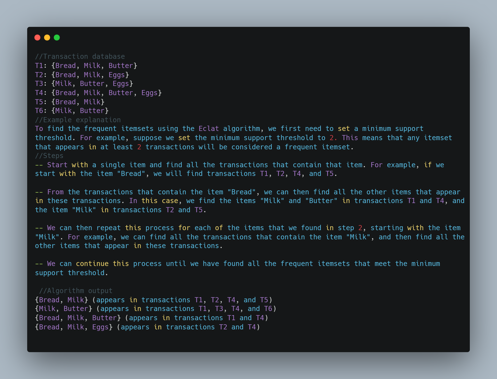

# ECLAT
This is Python PyQt project in which we applied some of ECLAT Algorithm features 

 - Eclat research

<iframe src="assets/Eclat_Algorithm_Research.pdf"
    frameBorder="0"
    scrolling="auto"
    height="600px"
    width="100%">
    </iframe>

 - Eclat example
 